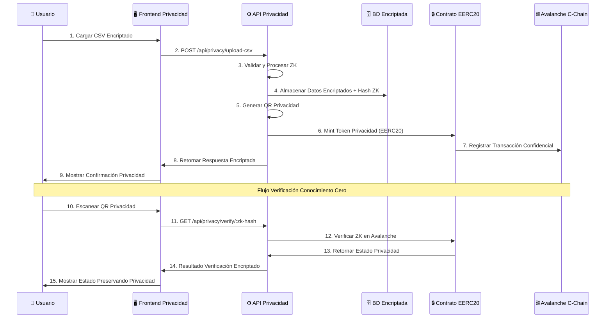

# Kredentia Backend - Edición Privacidad 🔒

<p align="center">
  
  
  
  
  
  
</p>

## 🎯 Hack2Build: Edición Privacidad - Plataforma de Certificación de Documentos

Kredentia es una **plataforma avanzada de certificación de documentos** construida para el **Avalanche Hack2Build: Edición Privacidad**. Aprovecha **tokens de privacidad EERC20**, **pruebas de Conocimiento Cero**, y **transacciones confidenciales** para proporcionar privacidad sin precedentes en la verificación de documentos.

### 🔐 **Características Centradas en Privacidad**

- **🛡️ Verificación de Documentos con Conocimiento Cero** - Verifica documentos sin revelar información sensible
- **⛓️ Tokens de Privacidad EERC20** - Tokens ERC20 mejorados con características de privacidad integradas
- **🔒 Transacciones Confidenciales** - Todas las transferencias de tokens preservan la privacidad del usuario
- **📊 Procesamiento CSV Encriptado** - Carga masiva de documentos con encriptación de extremo a extremo
- **🔍 Generación QR Anónima** - Códigos QR con pruebas de Conocimiento Cero embebidas
- **💼 Integración de Wallet Privada** - Vincula wallets preservando el anonimato

## 🏗️ Arquitectura del Sistema - Edición Privacidad

```mermaid
graph TB
    subgraph "CAPA FRONTEND PRIVACIDAD"
        A[🔒 Dashboard Privacidad]
        B[📄 Carga Documentos Encriptada]
        C[🔍 Verificación Conocimiento Cero]
        D[💼 Wallet Privacidad EERC20]
        E[📱 Escaner QR Anónimo]
    end

    subgraph "API BACKEND PRIVACIDAD (NestJS) - IMPLEMENTADO ✅"
        F[🛡️ Controlador Privacidad]
        G[⛓️ Controlador EERC20]
        H[🔐 Servicio Criptografía]
        I[📊 Servicio Documentos Encriptados]
        J[🔍 Servicio Conocimiento Cero]
        K[💾 Base Datos Consciente Privacidad]
    end

    subgraph "INTEGRACIÓN AVALANCHE C-CHAIN"
        L[🪙 Contratos Inteligentes EERC20]
        M[🛡️ Verificación Pruebas ZK]
        N[🔒 Transacciones Confidenciales]
        O[📋 Registro Documentos Privado]
        P[💳 Soporte Wallet Anónimo]
    end

    subgraph "INFRAESTRUCTURA PRIVACIDAD"
        Q[🔐 Encriptación AES-256-GCM]
        R[🧮 Pruebas Conocimiento Cero]
        S[🔒 Gestión Claves Privadas]
        T[📊 Almacenamiento Encriptado]
    end
        W[Almacenamiento IPFS Encriptado]
        X[Web3 Preservando Privacidad]
        Y[Generadores Pruebas ZK]
        Z[Computación Confidencial]
    end

    %% Conexiones Frontend a Backend
    A --> F
    B --> K
    C --> I
    D --> J
    E --> H

    %% Conexiones Internas Backend
    F --> G
    F --> H
    F --> I
    F --> J
    K --> H
    H --> L
    G --> M
    H --> M
    K --> N
    F --> O

    %% Backend a Blockchain Privacidad
    J --> P
    H --> Q
    I --> R
    G --> S
    F --> T
    L --> U

    %% Blockchain Privacidad a Servicios
    P --> V
    Q --> W
    R --> V
    S --> X
    T --> V
    U --> Y
    Q --> Z

    %% Flujo Datos Privacidad
    B -.->|1. Carga Encriptada| K
    K -.->|2. Proceso Privacidad| H
    H -.->|3. Generación Hash ZK| L
    L -.->|4. Almacenamiento Encriptado| M
    H -.->|5. Creación QR Privacidad| I
    I -.->|6. Mint Privado EERC20| P
    P -.->|7. Almacenamiento Confidencial| W
    E -.->|8. Verificación ZK| R

    classDef frontend fill:#e3f2fd,stroke:#1976d2,stroke-width:2px
    classDef backend fill:#f3e5f5,stroke:#7b1fa2,stroke-width:2px
    classDef database fill:#e8f5e8,stroke:#388e3c,stroke-width:2px
    classDef privacy fill:#fff3e0,stroke:#f57c00,stroke-width:3px
    classDef services fill:#fce4ec,stroke:#c2185b,stroke-width:2px

    class A,B,C,D,E frontend
    class F,G,H,I,J,K,L backend
    class M,N,O database
    class P,Q,R,S,T,U privacy
    class V,W,X,Y,Z services
```

### 🔐 Flujo Implementación Privacidad EERC20



## 📋 Descripción

**Kredentia Backend - Edición Privacidad** es una plataforma vanguardista de certificación de documentos enfocada en privacidad, construida para el **Avalanche Hack2Build: Privacy Edition**. Aprovecha los tokens **EERC20 (Enhanced ERC20)** en Avalanche C-Chain para proporcionar validación confidencial de documentos a través de pruebas de conocimiento cero, hashing encriptado e integración de wallets que preserva la privacidad.

### 🎯 Características Principales Enfocadas en Privacidad

- **� Integración EERC20**: Tokens ERC20 mejorados con características de privacidad en Avalanche
- **📄 Procesamiento CSV Encriptado**: Carga masiva y procesamiento de datos con conocimiento cero
- **🔐 Hashing de Conocimiento Cero**: Hashing privado de CI con pruebas ZK
- **📱 Generación QR Privado**: Códigos QR confidenciales para verificación de documentos
- **💳 Integración Wallet Confidencial**: Vinculación de direcciones de wallet que preserva privacidad
- **📊 Base de Datos Encriptada**: Almacenamiento de datos encriptado de extremo a extremo
- **📚 Documentación API Privada**: Documentación completa con consideraciones de privacidad
- **�️ Validación ZK**: Validación con pruebas de conocimiento cero usando criptografía avanzada
- **🌐 CORS Privado**: Intercambio seguro de recursos de origen cruzado
- **⛓️ Avalanche C-Chain**: Integración nativa con Avalanche para transacciones rápidas y económicas

## 🚀 Inicio Rápido

### Prerequisitos

- Node.js (v18 o superior)
- npm o yarn

### Instalación

```bash
# Clonar el repositorio
git clone <repository-url>
cd kredentia-backend

# Instalar dependencias
npm install

# Iniciar servidor de desarrollo
npm run start:dev
```

### 🌐 Puntos de Acceso

- **Servidor API**: http://localhost:3000
- **Swagger UI**: http://localhost:3000/api
- **Base de Datos**: Archivo SQLite (`database.sqlite`)

## 📡 Endpoints de API de Privacidad

| Método | Endpoint | Descripción | Nivel de Privacidad |
|--------|----------|-------------|---------------------|
| `POST` | `/api/privacy/upload-csv` | Subir CSV encriptado con validación ZK | 🔒 Alto |
| `GET` | `/api/privacy/generate-qr/:zk-hash` | Generar QR privado con pruebas ZK | 🔒 Alto |
| `PATCH` | `/api/privacy/add-wallet/:zk-hash` | Vincular dirección de wallet confidencial | 🔒 Alto |
| `GET` | `/api/privacy/verify/:zk-hash` | Verificación de documento con conocimiento cero | 🔒 Alto |
| `GET` | `/api/privacy/persons` | Obtener lista encriptada de personas (autorizado) | 🔒 Medio |
| `POST` | `/api/eerc20/mint` | Acuñar tokens de privacidad para documentos | 🔒 Alto |
| `GET` | `/api/eerc20/balance/:address` | Obtener balance confidencial de tokens | 🔒 Medio |

## 🛠️ Desarrollo

```bash
# Modo desarrollo con recarga automática
npm run start:dev

# Construir la aplicación
npm run build

# Ejecutar pruebas
npm run test

# Ejecutar pruebas e2e
npm run test:e2e

# Verificar cobertura de pruebas
npm run test:cov
```

## 📊 Esquema de Base de Datos

### Entidad Person
- `id`: Clave primaria auto-generada
- `ci`: Número de cédula de identidad (único)
- `nombre`: Primer nombre
- `apellido_paterno`: Apellido paterno
- `apellido_materno`: Apellido materno
- `wallet_address`: Wallet blockchain asociado (opcional)
- `created_at`: Marca de tiempo de creación
- `updated_at`: Marca de tiempo de última actualización

## 🔧 Configuración

### Variables de Entorno

Crear un archivo `.env`:

```env
# Configuración de Base de Datos
DB_TYPE=sqlite
DB_DATABASE=database.sqlite

# Configuración de Aplicación
PORT=3000
NODE_ENV=development
```

## 📚 Documentación de la API

Visita `http://localhost:3000/api` para documentación completa de Swagger con:

- Pruebas interactivas de API
- Esquemas de solicitud/respuesta
- Detalles de autenticación
- Ejemplos de payloads

## 🧪 Pruebas

El proyecto incluye pruebas integrales:

- **Pruebas Unitarias**: Pruebas de servicio y controlador
- **Pruebas de Integración**: Pruebas de API de extremo a extremo
- **Pruebas de Validación**: Pruebas de validación de entrada

## 🔮 Integraciones Futuras EERC20 y Privacidad

- **🔒 Contratos Inteligentes EERC20**: Contratos de tokens con privacidad mejorada en Avalanche
- **🖥️ Frontend de Privacidad**: React/Next.js con componentes de conocimiento cero
- **📊 Analytics Confidenciales**: Analytics de verificación de documentos que preserva privacidad
- **⛓️ Múltiples Cadenas de Privacidad**: Soporte para múltiples redes blockchain enfocadas en privacidad
- **🛡️ Pruebas ZK Avanzadas**: Implementación de zk-SNARKs y zk-STARKs
- **🔐 Encriptación Homomórfica**: Computación sobre datos encriptados
- **👤 Autenticación Anónima**: Verificación de identidad con conocimiento cero
- **💼 Privacidad Empresarial**: Gestión confidencial de documentos B2B

## 📝 Formato de Archivo CSV

Estructura CSV esperada para carga:

```csv
ci,nombre,apellido_paterno,apellido_materno
12345678,Juan,Pérez,González
87654321,María,López,Martínez
```

## 🤝 Contribuir

1. Haz fork del repositorio
2. Crea tu rama de característica (`git checkout -b feature/caracteristica-increible`)
3. Confirma tus cambios (`git commit -m 'Agregar alguna característica increíble'`)
4. Empuja a la rama (`git push origin feature/caracteristica-increible`)
5. Abre un Pull Request

## 📄 Licencia

Este proyecto está licenciado bajo la Licencia MIT - ve el archivo [LICENSE](LICENSE) para detalles.

## 🏗️ Arquitectura

Construido con tecnologías modernas:
- **NestJS**: Framework Node.js de grado empresarial
- **TypeORM**: ORM poderoso para operaciones de base de datos
- **Class Validator**: Validación robusta de entrada
- **Swagger**: Documentación y pruebas de API
- **SQLite**: Solución de base de datos liviana
cd kredentia-backend

# Instalar dependencias
npm install

# Iniciar servidor de desarrollo
npm run start:dev
```

### 🌐 Puntos de Acceso

- **Servidor API**: http://localhost:3000
- **Swagger UI**: http://localhost:3000/api
- **Base de Datos**: Archivo SQLite (`database.sqlite`)

## 📡 Endpoints de API de Privacidad

| Método | Endpoint | Descripción | Nivel de Privacidad |
|--------|----------|-------------|---------------------|
| `POST` | `/api/privacy/upload-csv` | Subir CSV encriptado con validación ZK | 🔒 Alto |
| `GET` | `/api/privacy/generate-qr/:zk-hash` | Generar QR privado con pruebas ZK | 🔒 Alto |
| `PATCH` | `/api/privacy/add-wallet/:zk-hash` | Vincular dirección de wallet confidencial | 🔒 Alto |
| `GET` | `/api/privacy/verify/:zk-hash` | Verificación de documento con conocimiento cero | 🔒 Alto |
| `GET` | `/api/privacy/persons` | Obtener lista encriptada de personas (autorizado) | 🔒 Medio |
| `POST` | `/api/eerc20/mint` | Acuñar tokens de privacidad para documentos | 🔒 Alto |
| `GET` | `/api/eerc20/balance/:address` | Obtener balance confidencial de tokens | 🔒 Medio |

## 🛠️ Desarrollo

```bash
# Modo desarrollo con recarga automática
npm run start:dev

# Construir la aplicación
npm run build

# Ejecutar pruebas
npm run test

# Ejecutar pruebas e2e
npm run test:e2e

# Verificar cobertura de pruebas
npm run test:cov
```

## 📊 Esquema de Base de Datos

### Entidad Person
- `id`: Clave primaria auto-generada
- `ci`: Número de cédula de identidad (único)
- `ci_hash`: Hash SHA-256 del CI para privacidad
- `nombre`: Primer nombre
- `apellido_paterno`: Apellido paterno
- `apellido_materno`: Apellido materno
- `wallet_address`: Wallet blockchain asociado (opcional)
- `created_at`: Marca de tiempo de creación
- `updated_at`: Marca de tiempo de última actualización

## 🔧 Configuración

### Variables de Entorno

Crear un archivo `.env`:

```env
# Configuración de Base de Datos
DB_TYPE=sqlite
DB_DATABASE=database.sqlite

# Configuración de Aplicación
PORT=3000
NODE_ENV=development
```

## 📚 Documentación de la API

Visita `http://localhost:3000/api` para documentación completa de Swagger con:

- Pruebas interactivas de API
- Esquemas de solicitud/respuesta
- Detalles de autenticación
- Ejemplos de payloads

## 🧪 Pruebas

El proyecto incluye pruebas integrales:

- **Pruebas Unitarias**: Pruebas de servicio y controlador
- **Pruebas de Integración**: Pruebas de API de extremo a extremo
- **Pruebas de Validación**: Pruebas de validación de entrada

## 🔮 Integraciones Futuras EERC20 y Privacidad

- **🔒 Contratos Inteligentes EERC20**: Contratos de tokens con privacidad mejorada en Avalanche
- **🖥️ Frontend de Privacidad**: React/Next.js con componentes de conocimiento cero
- **📊 Analytics Confidenciales**: Analytics de verificación de documentos que preserva privacidad
- **⛓️ Múltiples Cadenas de Privacidad**: Soporte para múltiples redes blockchain enfocadas en privacidad
- **🛡️ Pruebas ZK Avanzadas**: Implementación de zk-SNARKs y zk-STARKs
- **🔐 Encriptación Homomórfica**: Computación sobre datos encriptados
- **👤 Autenticación Anónima**: Verificación de identidad con conocimiento cero
- **💼 Privacidad Empresarial**: Gestión confidencial de documentos B2B

## 📝 Formato de Archivo CSV

Estructura CSV esperada para carga:

```csv
ci,nombre,apellido_paterno,apellido_materno
12345678,Juan,Pérez,González
87654321,María,López,Martínez
```

## 🤝 Contribuir

1. Haz fork del repositorio
2. Crea tu rama de característica (`git checkout -b feature/caracteristica-increible`)
3. Confirma tus cambios (`git commit -m 'Agregar alguna característica increíble'`)
4. Empuja a la rama (`git push origin feature/caracteristica-increible`)
5. Abre un Pull Request

## 📄 Licencia

Este proyecto está licenciado bajo la Licencia MIT - ve el archivo [LICENSE](LICENSE) para detalles.

## 🏗️ Arquitectura

Construido con tecnologías modernas:
- **NestJS**: Framework Node.js de grado empresarial
- **TypeORM**: ORM poderoso para operaciones de base de datos
- **Class Validator**: Validación robusta de entrada
- **Swagger**: Documentación y pruebas de API
- **SQLite**: Solución de base de datos liviana
