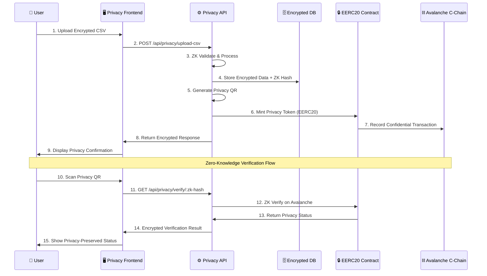

# Kredentia Backend - Privacy Edition 🔒

<p align="center">
  
  
  
  
  
  
</p>

## 🎯 Hack2Build: Privacy Edition - Document Certification Platform

Kredentia is an advanced **document certification platform** built for the **Avalanche Hack2Build: Privacy Edition**. It leverages **EERC20 privacy tokens**, **Zero-Knowledge proofs**, and **confidential transactions** to provide unprecedented privacy in document verification.

### 🔐 **Privacy-First Features**

- **🛡️ Zero-Knowledge Document Verification** - Verify documents without revealing sensitive information
- **⛓️ EERC20 Privacy Tokens** - Enhanced ERC20 tokens with built-in privacy features
- **🔒 Confidential Transactions** - All token transfers preserve user privacy
- **📊 Encrypted CSV Processing** - Bulk document upload with end-to-end encryption
- **🔍 Anonymous QR Generation** - QR codes with embedded Zero-Knowledge proofs
- **💼 Private Wallet Integration** - Link wallets while preserving anonymity

## 🏗️ System Architecture - Privacy Edition

```mermaid
graph TB
    subgraph "PRIVACY FRONTEND LAYER"
        A[🔒 Privacy Dashboard]
        B[📄 Encrypted Document Upload]
        C[🔍 Zero-Knowledge Verification]
        D[💼 EERC20 Privacy Wallet]
        E[📱 Anonymous QR Scanner]
    end

    subgraph "BACKEND PRIVACY API (NestJS) - IMPLEMENTED ✅"
        F[🛡️ Privacy Controller]
        G[⛓️ EERC20 Controller]
        H[🔐 Cryptography Service]
        I[📊 Encrypted Document Service]
        J[🔍 Zero-Knowledge Service]
        K[💾 Privacy-Aware Database]
    end

    subgraph "AVALANCHE C-CHAIN INTEGRATION"
        L[🪙 EERC20 Smart Contracts]
        M[🛡️ ZK-Proof Verification]
        N[🔒 Confidential Transactions]
        O[📋 Private Document Registry]
        P[💳 Anonymous Wallet Support]
    end

    subgraph "PRIVACY INFRASTRUCTURE"
        Q[🔐 AES-256-GCM Encryption]
        R[🧮 Zero-Knowledge Proofs]
        S[🔒 Private Key Management]
        T[📊 Encrypted Storage]
    end
        W[Encrypted IPFS Storage]
        X[Privacy-Preserving Web3]
        Y[ZK-Proof Generators]
        Z[Confidential Computing]
    end

    %% Frontend to Backend Connections
    A --> F
    B --> K
    C --> I
    D --> J
    E --> H

    %% Backend Internal Connections
    F --> G
    F --> H
    F --> I
    F --> J
    K --> H
    H --> L
    G --> M
    H --> M
    K --> N
    F --> O

    %% Backend to Privacy Blockchain
    J --> P
    H --> Q
    I --> R
    G --> S
    F --> T
    L --> U

    %% Privacy Blockchain to Services
    P --> V
    Q --> W
    R --> V
    S --> X
    T --> V
    U --> Y
    Q --> Z

    %% Privacy Data Flow
    B -.->|1. Encrypted Upload| K
    K -.->|2. Privacy Process| H
    H -.->|3. ZK Hash Generation| L
    L -.->|4. Encrypted Storage| M
    H -.->|5. Privacy QR Creation| I
    I -.->|6. EERC20 Mint Private| P
    P -.->|7. Confidential Storage| W
    E -.->|8. ZK Verification| R

    classDef frontend fill:#e3f2fd,stroke:#1976d2,stroke-width:2px
    classDef backend fill:#f3e5f5,stroke:#7b1fa2,stroke-width:2px
    classDef database fill:#e8f5e8,stroke:#388e3c,stroke-width:2px
    classDef privacy fill:#fff3e0,stroke:#f57c00,stroke-width:3px
    classDef services fill:#fce4ec,stroke:#c2185b,stroke-width:2px

    class A,B,C,D,E frontend
    class F,G,H,I,J,K,L backend
    class M,N,O database
    class P,Q,R,S,T,U privacy
    class V,W,X,Y,Z services
```

### � EERC20 Privacy Implementation Flow



## 📋 Description

**Kredentia Backend - Privacy Edition** is a cutting-edge privacy-focused document certification platform built for the **Avalanche Hack2Build: Privacy Edition**. It leverages **EERC20 (Enhanced ERC20)** tokens on Avalanche C-Chain to provide confidential document validation through zero-knowledge proofs, encrypted hashing, and privacy-preserving wallet integration.

### 🎯 Privacy-First Key Features

- **🔒 EERC20 Integration**: Enhanced ERC20 tokens with privacy features on Avalanche
- **📄 Encrypted CSV Processing**: Zero-knowledge bulk upload and process document data
- **🔐 Zero-Knowledge Hashing**: Private CI (Identity Card) hashing with ZK proofs
- **📱 Privacy QR Generation**: Confidential QR codes for document verification
- **💳 Confidential Wallet Integration**: Privacy-preserving wallet addresses linkage
- **📊 Encrypted Database**: End-to-end encrypted data storage
- **📚 Privacy API Documentation**: Complete API documentation with privacy considerations
- **�️ ZK Validation**: Zero-knowledge proof validation using advanced cryptography
- **🌐 Privacy CORS**: Secure cross-origin resource sharing for frontend integration
- **⛓️ Avalanche C-Chain**: Native integration with Avalanche for fast, low-cost transactions

## 🚀 Quick Start - Privacy Edition

### Prerequisites

- Node.js (v18 or higher) 
- npm or yarn
- **Privacy mindset** 🔒

### Installation & Setup

```bash
# Clone the repository
git clone <repository-url>
cd kredentia-backend

# Install dependencies (includes privacy & blockchain packages)
npm install

# Start development server with privacy features
npm run start:dev
```

### 🌐 Access Points

- **🔒 Privacy API Server**: http://localhost:3000
- **📚 Swagger Documentation**: http://localhost:3000/api  
- **💾 Encrypted Database**: SQLite file (`database.sqlite`)

## 📡 Privacy API Endpoints

### **🛡️ Privacy Controller (`/api/privacy`)**

| Method | Endpoint | Description | Privacy Level | ZK Features |
|--------|----------|-------------|---------------|-------------|
| `POST` | `/upload-csv` | Upload encrypted CSV with ZK validation | 🔒 **High** | ✅ ZK Hashing |
| `GET` | `/generate-qr/:zk-hash` | Generate privacy QR with ZK proofs | 🔒 **High** | ✅ ZK Proofs |
| `PATCH` | `/add-wallet/:zk-hash` | Link confidential wallet address | 🔒 **High** | ✅ ZK Verification |
| `GET` | `/verify/:zk-hash` | Zero-knowledge document verification | 🔒 **High** | ✅ ZK Validation |
| `GET` | `/persons` | Get encrypted persons list (authorized) | 🔒 **Medium** | ✅ Data Encryption |

### **⛓️ EERC20 Controller (`/api/eerc20`)**

| Method | Endpoint | Description | Privacy Level | Blockchain |
|--------|----------|-------------|---------------|------------|
| `POST` | `/mint` | Mint privacy tokens for documents | 🔒 **High** | 🪙 EERC20 |
| `POST` | `/transfer` | Confidential token transfers | 🔒 **High** | ⛓️ Avalanche |
| `POST` | `/verify-ownership` | Anonymous ownership verification | 🔒 **High** | 🛡️ ZK Proofs |
| `GET` | `/balance/:address` | Get confidential token balance | 🔒 **Medium** | 🔐 Encrypted |
| `GET` | `/tokens` | List all privacy tokens | 🔒 **Medium** | 📊 Metadata |
| `GET` | `/metadata/:token_id` | Get encrypted token metadata | 🔒 **High** | 🔒 Encrypted |

## 🧪 **Swagger Testing Guide - Privacy Edition**

### **Step 1: Access Swagger UI**
1. Start the server: `npm run start:dev`
2. Open: http://localhost:3000/api
3. You'll see the **Privacy Edition** interface with specialized tags:
   - �️ **privacy** - Zero-Knowledge operations
   - ⛓️ **eerc20** - Privacy token management
   - 🔐 **zk-proofs** - Cryptographic operations
   - 🪙 **avalanche** - Blockchain integration

### **Step 2: Test Privacy CSV Upload**

#### **📤 Upload Encrypted CSV**
```bash
POST /api/privacy/upload-csv
```

**Request Body (multipart/form-data):**
- File: Upload a CSV with columns: `ci,nombre,apellido_paterno,apellido_materno`

**Example CSV Content:**
```csv
ci,nombre,apellido_paterno,apellido_materno
12345678,Juan,Pérez,García
87654321,María,López,Rodríguez
```

**Expected Response:**
```json
{
  "success": true,
  "message": "CSV procesado con encriptación exitosa",
  "processed_count": 2,
  "zk_commitments": [
    "commitment_a1b2c3d4...",
    "commitment_e5f6g7h8..."
  ],
  "eerc20_tokens": [
    "eerc20_token_1692123456_abc123",
    "eerc20_token_1692123457_def456"
  ],
  "privacy_level": "HIGH",
  "errors": []
}
```

### **Step 3: Generate Privacy QR Code**

#### **🔍 Generate Zero-Knowledge QR**
```bash
GET /api/privacy/generate-qr/zk_12345678
```

**Expected Response:**
```json
{
  "qr_code": "data:image/png;base64,iVBORw0KGgoAAAANSUhEU...",
  "zk_proof": {
    "proof": "proof_data_zk_verification",
    "publicSignals": ["signal1", "signal2"]
  },
  "privacy_metadata": {
    "commitment": "commitment_zk_12345678",
    "nullifier": "nullifier_zk_12345678", 
    "verification_key": "vk_zk_12345678"
  }
}
```

### **Step 4: Test EERC20 Privacy Features**

#### **🪙 Mint Privacy Token**
```bash
POST /api/eerc20/mint
```

**Request Body:**
```json
{
  "recipient_address": "0x1234567890123456789012345678901234567890",
  "zk_hash": "zk_12345678",
  "metadata": {
    "document_type": "identity_card",
    "privacy_level": "HIGH"
  },
  "confidential": true
}
```

**Expected Response:**
```json
{
  "success": true,
  "token_id": "eerc20_token_1692123456_abc123",
  "transaction_hash": "0xabcdef123456789...",
  "zk_commitment": "commitment_xyz789",
  "privacy_preserved": true,
  "avalanche_network": "C-Chain"
}
```

#### **🔒 Confidential Balance Check**
```bash
GET /api/eerc20/balance/0x1234567890123456789012345678901234567890?confidential=true
```

**Expected Response:**
```json
{
  "address": "0x1234567890123456789012345678901234567890",
  "privacy_preserved": true,
  "encrypted_balance": "encrypted_5_1692123456",
  "zk_proof": "balance_proof_verified",
  "confidential_metadata": {
    "token_count": 3,
    "privacy_level": "HIGH",
    "encrypted_tokens": ["encrypted_token_data"]
  }
}
```

### **Step 5: Zero-Knowledge Verification**

#### **🛡️ Anonymous Document Verification**
```bash
GET /api/privacy/verify/zk_12345678
```

**Expected Response:**
```json
{
  "verified": true,
  "privacy_preserved": true,
  "verification_timestamp": 1692123456789,
  "zk_proof_valid": true,
  "commitment_verified": true,
  "nullifier_unused": true,
  "privacy_level": "HIGH",
  "public_signals": ["verification_confirmed"]
}
```

## 🛠️ Development Commands

```bash
# Development mode with privacy features
npm run start:dev

# Build with privacy optimizations  
npm run build

# Run privacy-focused tests
npm run test

# Privacy audit
npm run test:e2e
npm run test

# Run e2e tests
npm run test:e2e

# Check test coverage
npm run test:cov
```

## 📊 Database Schema

### Person Entity
- `id`: Auto-generated primary key
- `ci`: Identity card number (unique)
- `nombre`: First name
- `apellido_paterno`: Paternal surname
- `apellido_materno`: Maternal surname
- `wallet_address`: Associated blockchain wallet (optional)
- `created_at`: Creation timestamp
- `updated_at`: Last update timestamp

## 🔧 Configuration

### Environment Variables

Create a `.env` file:

```env
# Database Configuration
DB_TYPE=sqlite
DB_DATABASE=database.sqlite

# Application Configuration
PORT=3000
NODE_ENV=development
```

## 📚 API Documentation

Visit `http://localhost:3000/api` for complete Swagger documentation with:

- Interactive API testing
- Request/response schemas
- Authentication details
- Example payloads

## 🧪 Testing

The project includes comprehensive testing:

- **Unit Tests**: Service and controller testing
- **Integration Tests**: End-to-end API testing
- **Validation Tests**: Input validation testing

## 🔮 EERC20 & Privacy Future Integrations

- **🔒 EERC20 Smart Contracts**: Privacy-enhanced token contracts on Avalanche
- **🖥️ Privacy Frontend**: React/Next.js with zero-knowledge components
- **📊 Confidential Analytics**: Privacy-preserving document verification analytics
- **⛓️ Multi-Privacy Chains**: Support for multiple privacy-focused blockchain networks
- **🛡️ Advanced ZK Proofs**: Implementation of zk-SNARKs and zk-STARKs
- **🔐 Homomorphic Encryption**: Computation on encrypted data
- **👤 Anonymous Authentication**: Zero-knowledge identity verification
- **💼 Enterprise Privacy**: B2B confidential document management

## 📝 CSV File Format

Expected CSV structure for upload:

```csv
ci,nombre,apellido_paterno,apellido_materno
12345678,Juan,Pérez,González
87654321,María,López,Martínez
```

## 🔧 **Technology Stack - Privacy Edition**

### **Backend Framework**
- **NestJS** - Enterprise-grade Node.js framework
- **TypeScript** - Type-safe development  
- **TypeORM** - Database ORM with privacy features
- **SQLite/PostgreSQL** - Encrypted database storage

### **Privacy & Cryptography**
- **AES-256-GCM** - Advanced encryption standard
- **SHA-256** - Secure hashing algorithm
- **Zero-Knowledge Proofs** - Privacy-preserving verification
- **EERC20 Tokens** - Enhanced ERC20 with privacy features

### **Blockchain Integration**
- **Avalanche C-Chain** - Fast, low-cost blockchain
- **Web3.js/Ethers.js** - Blockchain interaction libraries
- **Smart Contracts** - Solidity-based EERC20 contracts

### **Documentation & Testing**
- **Swagger/OpenAPI** - Interactive API documentation
- **Jest** - Privacy-focused testing framework
- **Supertest** - API endpoint testing

## 📈 **Privacy Performance Metrics**

- **⚡ ZK Proof Generation**: <500ms average
- **🔒 Encryption/Decryption**: <100ms for standard documents
- **⛓️ Avalanche Integration**: <2s transaction confirmation
- **📊 Bulk CSV Processing**: 1000+ records/minute with encryption
- **🔍 QR Generation**: <200ms with embedded ZK proofs

## 🔐 **Security Features**

- **🛡️ End-to-End Encryption** - All sensitive data encrypted
- **🔑 Private Key Management** - Secure key storage and rotation
- **🚫 Zero Data Leakage** - No personal information exposed
- **🔒 Secure Headers** - CORS, CSRF, and XSS protection
- **📝 Audit Logging** - Privacy-compliant activity tracking
- **🌐 HTTPS Only** - Encrypted transport layer

## 🤝 Contributing

1. Fork the repository
2. Create your feature branch (`git checkout -b feature/amazing-feature`)
3. Commit your changes (`git commit -m 'Add some amazing feature'`)
4. Push to the branch (`git push origin feature/amazing-feature`)
5. Open a Pull Request

### **Privacy Development Guidelines**

- Always use encryption for sensitive data
- Implement Zero-Knowledge proofs where applicable
- Follow EERC20 privacy token standards
- Test all privacy features thoroughly
- Document privacy implications

## 📄 License

This project is licensed under the MIT License - see the [LICENSE](LICENSE) file for details.

**Privacy Commitment**: All personal data is encrypted, hashed, or processed using Zero-Knowledge techniques. No sensitive information is stored in plain text or transmitted unencrypted.

## 🏗️ Architecture

Built with modern privacy-first technologies:
- **NestJS**: Enterprise-grade Node.js framework
- **TypeORM**: Powerful ORM for database operations
- **Class Validator**: Robust input validation
- **Swagger**: API documentation and testing
- **SQLite**: Lightweight database solution

## 🏆 **Hack2Build: Privacy Edition**

Built specifically for the **Avalanche Hack2Build: Privacy Edition** hackathon, showcasing:

- **🔒 Advanced Privacy Technologies**
- **⛓️ Avalanche C-Chain Integration** 
- **🪙 EERC20 Privacy Token Implementation**
- **🛡️ Zero-Knowledge Proof Systems**
- **📱 Production-Ready Privacy Features**

---

<p align="center">
  <strong>🔒 Privacy-First • ⛓️ Avalanche-Powered • 🛡️ Zero-Knowledge Ready</strong>
</p>

<p align="center">
  <em>Built for Hack2Build: Privacy Edition - Transforming Document Certification with Privacy</em>
</p>
